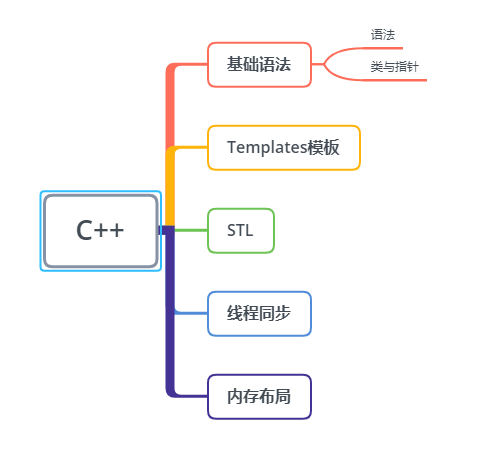

# C++学习路线
与Java对比

## 视C++为一个语言联邦
C++是语言联邦，它综合了多种编程语言的特点，是多重范型编程语言（注意是范型，不是泛型），支持过程形式（procedural），面向对象形式（object-oriented），函数形式（functionnal），泛型形式（generic），元编程形式（meta programming）。

* C：说到底C++仍是以C为基础。区块，语句，预处理器，内置数据类型，数组，指针统统来自C。
* Object-Oreinted C++：这一部分是面向对象设计之古典守则在C++上的最直接实施。类，封装，继承，多态，virtual函数等等...
* Template C++：这是C++泛型编程部分。
* STL。STL是个template程序库：容器（containers），迭代器（iterators），算法（algorithms）以及函数对象（function objects）

## C++11的特性
C++11的特性主要包括下面几个方面：

* 提高运行效率的语言特性：右值引用、泛化常量表达式
* 原有语法的使用性增强：初始化列表、统一的初始化语法、类型推导、范围for循环、Lambda表达式、final和override、构造函数委托
* 语言能力的提升：空指针nullptr、default和delete、长整数、静态assert
* C++标准库的更新：智能指针、正则表达式、哈希表等

## 参考文章

[C++ Primer](https://github.com/applenob/Cpp_Primer_Practice),[Effective C++](https://blog.csdn.net/SiberiaBear/article/details/106414968),[Effective Modern C++](https://github.com/kelthuzadx/EffectiveModernCppChinese),[现代 C++ 教程：高速上手 C++ 11/14/17/20](https://changkun.de/modern-cpp/zh-cn/00-preface/)

## 项目
[设计模式](https://github.com/JakubVojvoda/design-patterns-cpp)
[json-tutorial](https://github.com/miloyip/json-tutorial)