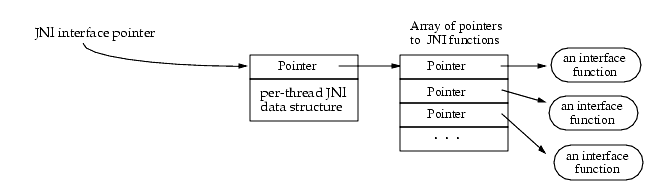
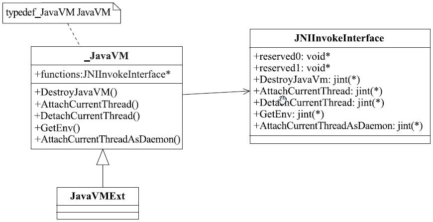
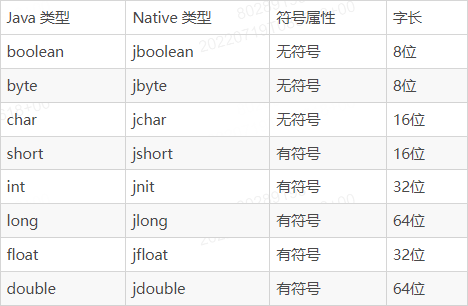
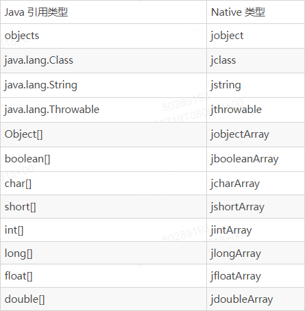
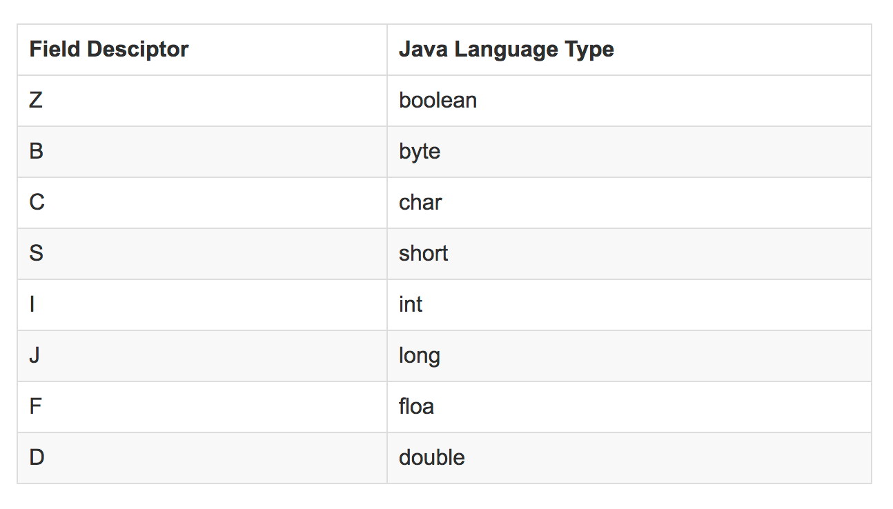

# JNI
JNI 是指 Java 原生接口。它定义了从受管理代码（使用 Java 或 Kotlin 编程语言编写）编译的字节码与原生代码（使用 C/C++ 编写）互动的方式。JNI 不依赖于供应商，支持从动态共享库加载代码，虽然有时较为繁琐，但效率尚可。

## Java Native Interface Overview
While you can write applications entirely in Java, there are situations where Java alone does not meet the needs of your application. Programmers use the JNI to write Java native methods to handle those situations when an application cannot be written entirely in Java.

* The following examples illustrate when you need to use Java native methods:
* The standard Java class library does not support the platform-dependent features needed by the application.
You already have a library written in another language, and wish to make it accessible to Java code through the JNI.
* You want to implement a small portion of time-critical code in a lower-level language such as assembly.

By programming through the JNI, you can use native methods to:

* Create, inspect, and update Java objects (including arrays and strings).
* Call Java methods.
* Catch and throw exceptions.
* Load classes and obtain class information.
* Perform runtime type checking.

## JNI Interface Functions and Pointers
Native code accesses Java VM features by calling JNI functions. JNI functions are available through an interface pointer. An interface pointer is a pointer to a pointer. This pointer points to an array of pointers, each of which points to an interface function. Every interface function is at a predefined offset inside the array. Figure 2-1 illustrates the organization of an interface pointer.

## VM
VM和Runtime虚拟机一词的英文为Virtual Machine（简写为VM）。Runtime则是另外一个在虚拟机技术领域常用于表示虚拟机的单词。在ART虚拟机Native层代码中，Runtime是一个类。而JDK源码里也有一个Runtime类（位于java.lang包下）。这个Java Runtime类提供了一些针对整个虚拟机层面而言的API，比如exit（退出虚拟机）、gc（触发垃圾回收）、load（加载动态库）等。

### JavaVM与JNIEnv
JavaVM在JNI层中表示Java虚拟机。它的作用有点像Runtime。只不过JNI作为一种规范，它必须设定一个统一的结构，即此处的JavaVM。不同的虚拟机实现里，真实的虚拟机对象可以完全不一样，比如art虚拟机中的Runtime才是当之无愧的虚拟机。另外，一个Java进程只有一个JavaVM实例。在ART虚拟机中，JavaVM实际代表的是JavaVMExt类。

JNIEnv代表JNI环境，每一个需要和Java交互（不管是Java层进入Native层，还是Native层进入Java层）的线程都有一个独立的JNIEnv对象。同理，JNIEnv是JNI规范里指定的数据结构，不同虚拟机有不同的实现。在ART虚拟机中，JNIEnv实际代表的是JNIEnvExt类。

JavaVMExt,art/runtime/jni/java_vm_ext.cc
	
	JavaVMExt::JavaVMExt(Runtime* runtime,
	                     const RuntimeArgumentMap& runtime_options,
	                     std::string* error_msg)
	    : runtime_(runtime),
	      check_jni_abort_hook_(nullptr),
	      check_jni_abort_hook_data_(nullptr),
	      check_jni_(false),  // Initialized properly in the constructor body below.
	      force_copy_(runtime_options.Exists(RuntimeArgumentMap::JniOptsForceCopy)),
	      tracing_enabled_(runtime_options.Exists(RuntimeArgumentMap::JniTrace)
	                       || VLOG_IS_ON(third_party_jni)),
	      trace_(runtime_options.GetOrDefault(RuntimeArgumentMap::JniTrace)),
	      globals_(kGlobalsMax, kGlobal, IndirectReferenceTable::ResizableCapacity::kNo, error_msg),
	      libraries_(new Libraries),
	      unchecked_functions_(&gJniInvokeInterface),
	      weak_globals_(kWeakGlobalsMax,
	                    kWeakGlobal,
	                    IndirectReferenceTable::ResizableCapacity::kNo,
	                    error_msg),
	      allow_accessing_weak_globals_(true),
	      weak_globals_add_condition_("weak globals add condition",
	                                  (CHECK(Locks::jni_weak_globals_lock_ != nullptr),
	                                   *Locks::jni_weak_globals_lock_)),
	      env_hooks_lock_("environment hooks lock", art::kGenericBottomLock),
	      env_hooks_(),
	      enable_allocation_tracking_delta_(
	          runtime_options.GetOrDefault(RuntimeArgumentMap::GlobalRefAllocStackTraceLimit)),
	      allocation_tracking_enabled_(false),
	      old_allocation_tracking_state_(false) {
	  functions = unchecked_functions_;
	  SetCheckJniEnabled(runtime_options.Exists(RuntimeArgumentMap::CheckJni) || kIsDebugBuild);
	}
	JNIInvokeInterface
	const JNIInvokeInterface gJniInvokeInterface = {
	  nullptr,  // reserved0
	  nullptr,  // reserved1
	  nullptr,  // reserved2
	  JII::DestroyJavaVM,
	  JII::AttachCurrentThread,
	  JII::DetachCurrentThread,
	  JII::GetEnv,
	  JII::AttachCurrentThreadAsDaemon
	};

JNIEnv,libnativehelper/include_jni/jni.h

	struct _JNIEnv {
	    /* do not rename this; it does not seem to be entirely opaque */
	    const struct JNINativeInterface* functions;
	
	#if defined(__cplusplus)
	
	    jint GetVersion()
	    { return functions->GetVersion(this); }
	
	    jclass DefineClass(const char *name, jobject loader, const jbyte* buf,
	        jsize bufLen)
	    { return functions->DefineClass(this, name, loader, buf, bufLen); }
	
	    jclass FindClass(const char* name)
	    { return functions->FindClass(this, name); }
	
	    jmethodID FromReflectedMethod(jobject method)
	    { return functions->FromReflectedMethod(this, method); }
	
	    jfieldID FromReflectedField(jobject field)
	    { return functions->FromReflectedField(this, field); }

JNINativeInterface

	struct JNINativeInterface {
	    void*       reserved0;
	    void*       reserved1;
	    void*       reserved2;
	    void*       reserved3;
	
	    jint        (*GetVersion)(JNIEnv *);
	
	    jclass      (*DefineClass)(JNIEnv*, const char*, jobject, const jbyte*,
	                        jsize);
	    jclass      (*FindClass)(JNIEnv*, const char*);
	
	    jmethodID   (*FromReflectedMethod)(JNIEnv*, jobject);
	    jfieldID    (*FromReflectedField)(JNIEnv*, jobject);
	    /* spec doesn't show jboolean parameter */
	    jobject     (*ToReflectedMethod)(JNIEnv*, jclass, jmethodID, jboolean);
	
	    jclass      (*GetSuperclass)(JNIEnv*, jclass);
	    jboolean    (*IsAssignableFrom)(JNIEnv*, jclass, jclass);

## 数据结构
libnativehelper/include_jni/jni.h

	#include <stdarg.h>
	#include <stdint.h>
	
	/* Primitive types that match up with Java equivalents. */
	typedef uint8_t  jboolean; /* unsigned 8 bits */
	typedef int8_t   jbyte;    /* signed 8 bits */
	typedef uint16_t jchar;    /* unsigned 16 bits */
	typedef int16_t  jshort;   /* signed 16 bits */
	typedef int32_t  jint;     /* signed 32 bits */
	typedef int64_t  jlong;    /* signed 64 bits */
	typedef float    jfloat;   /* 32-bit IEEE 754 */
	typedef double   jdouble;  /* 64-bit IEEE 754 */

### 基本数据类型转换
在 Java 中传递的参数类型是 int，而在 JNI 中就成了 jint，这就涉及到 Java 到 JNI 的数据类型转换。

### 引用数据类型转换
除了基本数据类型之外，引用数据类型也有着一一对应。

## JNI 描述符
### 域描述符
基本类型描述符
下面是基本的数据类型的描述符，除了 boolean 和 long 类型分别是 Z 和 J 外，其他的描述符对应的都是Java类型名的大写首字母。另外，void 的描述符为 V

### 引用类型描述符
一般引用类型描述符的规则如下，注意不要丢掉“；”

	L + 类描述符 + ;
如，String 类型的域描述符为：

	Ljava/lang/String;

数组的域描述符特殊一点，如下，其中有多少级数组就有多少个“[”，数组的类型为类时，则有分号，为基本类型时没有分号

	[ + 其类型的域描述符

例如：

	int[]    描述符为 [I
	double[] 描述符为 [D
	String[] 描述符为 [Ljava/lang/String;
	Object[] 描述符为 [Ljava/lang/Object;
	int[][]  描述符为 [[I
	double[][] 描述符为 [[D

对应在 jni.h 获取 Java 的字段的 native 函数如下，name为 Java 的字段名字，sig 为域描述符

	//C
	jfieldID    (*GetFieldID)(JNIEnv*, jclass, const char*, const char*);
	jobject     (*GetObjectField)(JNIEnv*, jobject, jfieldID);
	//C++
	jfieldID GetFieldID(jclass clazz, const char* name, const char* sig)
	    { return functions->GetFieldID(this, clazz, name, sig); }
	jobject GetObjectField(jobject obj, jfieldID fieldID)
	    { return functions->GetObjectField(this, obj, fieldID); }

### 类描述符
类描述符是类的完整名称：包名+类名，java 中包名用 . 分割，jni 中改为用 / 分割如，Java 中 java.lang.String 类的描述符为 java/lang/String

native 层获取 Java 的类对象，需要通过 FindClass() 函数获取， jni.h 的函数定义如下：

	//C
	jclass  (*FindClass)(JNIEnv*, const char*);
	//C++
	jclass FindClass(const char* name)
	    { return functions->FindClass(this, name); }
字符串参数就是类的引用类型描述符，如 Java 对象 cn.cfanr.jni.JniTest，对应字符串为Lcn/cfanr/jni/JniTest; 如下：

	jclass jclazz = env->FindClass("Lcn/cfanr/jni/JniTest;");
### 方法描述符
方法描述符需要将所有参数类型的域描述符按照声明顺序放入括号，然后再加上返回值类型的域描述符，其中没有参数时，不需要括号，如下规则：
(参数……)返回类型
例如：

	  Java 层方法   ——>  JNI 函数签名
	String getString()  ——>  Ljava/lang/String;
	int sum(int a, int b)  ——>  (II)I
	void main(String[] args) ——> ([Ljava/lang/String;)V

## 引用型对象管理
JNI以不透明引用(opaque references)的方式提供了一些实例和数组类型(jobject, jclass, jstring, jarray等)以供本地方法使用。本地代码不能直接访问不透明引用所指向的内容，而只能借助JNI方法去访问这些数据结构，这样开发者就不用考虑JVM中的对象的存储方式。这样的话，必须要了解JNI中的几种引用:

JNI提供三种不透明引用: 局部引用，全局引用和弱全局引用。

* 局部引用和全局引用有着不同的生命周期。局部引用会自动被释放，而全局引用和弱全局引用则需要程序员手动释放，否则会一直存在。
* 局部引用和全局引用会阻止GC回收所指向的对象，而弱全局引用则允许垃圾回收。
* 不是所有的引用都能在整个程序的上下文中被使用，比如在函数返回后继续使用局部引用(相对于该函数而言)是不合法的。
### 局部引用（LocalRef）
传递给原生方法的每个参数，以及 JNI 函数返回的几乎每个对象都属于“局部引用”。这意味着，局部引用在当前线程中的当前原生方法运行期间有效。在原生方法返回后，即使对象本身继续存在，该引用也无效。

	/* This code is illegal */ 
	jstring MyNewString(JNIEnv *env, jchar *chars, jint len) {    
	    static jclass stringClass = NULL;    
	    jmethodID cid;    
	    jcharArray elemArr;    
	    jstring result;
	    if (stringClass == NULL) {        
	        stringClass = (*env)->FindClass(env, "java/lang/String");        
	        if (stringClass == NULL) {            
	            return NULL; 
	            /* exception thrown */        
	        }    
	    }    
	    /* It is wrong to use the cached stringClass here, because it may be invalid. */    
	    cid = (*env)->GetMethodID(env, stringClass, "<init>", "([C)V");    
	    ...    
	    elemArr = (*env)->NewCharArray(env, len);    
	    ... 
	    result = (*env)->NewObject(env, stringClass, cid, elemArr);    
	    (*env)->DeleteLocalRef(env, elemArr);    
	    return result; 
	}

### 全局引用（GlobalRef）
全局引用可以跨线程使用，在程序员显式的释放之前，它都是有效的。
但和局部引用能被绝大多数JNI函数创建不一样的是，全局引用只能被NewGlobalRef创建。 

	jstring MyNewString(JNIEnv *env, jchar *chars, jint len) 
	{    
	    static jclass stringClass = NULL;    
	    jmethodID cid;    
	    jcharArray elemArr;    
	    jstring result;
	    if (stringClass == NULL) { 
	        jclass localClass = NULL;    
	        localClass = (*env)->FindClass(env, "java/lang/String");        
	        if (localClass == NULL) {            
	            return NULL; 
	            /* exception thrown */        
	        }    
	        stringClass=(*env)->NewGlobalRef(env,localClass);
	        (*env)->DeleteLocalRef(env,localClass);
	    }    
	     
	    cid = (*env)->GetMethodID(env, stringClass, "<init>", "([C)V");    
	   
	    elemArr = (*env)->NewCharArray(env, len);    
	    (*env)->SetCharArrayRegion(env, elemArr, 0, len, chars);
	    result = (*env)->NewObject(env, stringClass, cid, elemArr);    
	    (*env)->DeleteLocalRef(env, elemArr);    
	    return result; 
	}
### 全局弱应用（WeakGlobalRef）
弱全局引用是JDK1.2之后的特性，通过NewGlobalWeakRef和DeleteGlobalWeakRef创建和销毁。弱全局引用有着和全局引用一样的生命周期(跨调用和跨线程), 但是有可能会自动被GC释放。 

	NIEXPORT void JNICALL Java_mypkg_MyCls_f(JNIEnv *env, jobject self) {    
	    static jclass myCls2 = NULL;    
	    if (myCls2 == NULL) {        
	        jclass myCls2Local = (*env)->FindClass(env, "mypkg/MyCls2");        
	        if (myCls2Local == NULL) {            
	            return; 
	            /* can’t find class */        
	        }       
	        myCls2 = NewWeakGlobalRef(env, myCls2Local);        
	        if (myCls2 == NULL) {            
	            return; 
	            /* out of memory */        
	        }    
	    } 
	    ... /* use myCls2 */
	}
### 引用的对比
对于给定的两个引用(局部，全局，弱全局)，可以检查他们是否指向同一个对象:

	(*env)->IsSameObject(env, obj1, obj2)
弱全局引用的规则有所不同。NULL弱引用同样的指向一个null对象，但是IsSameObject的返回值有不一样的意义。你可以使用IsSameObject来判断一个non-NULL弱引用是否指向仍然指向一个未被回收的对象。假设wobj是一个non-NULL的弱引用， 在wobj所指向的对象已经被回收时返回JNI_TRUE, 否则返回JNI_FALSE。 

	(*env)->IsSameObject(env, wobj, NULL)
## 线程
所有线程都是 Linux 线程，由内核调度。线程通常从受管理代码启动（使用 Thread.start()），但也可以在其他位置创建，然后附加到 JavaVM。例如，可以使用 AttachCurrentThread() 或 AttachCurrentThreadAsDaemon() 函数附加通过 pthread_create() 或 std::thread 启动的线程。在附加之前，线程不包含任何 JNIEnv，也无法调用 JNI。  
Java端代码:

	Java本地方法类NativeThread.java代码:
	package com.xxx.api.thread;
	import android.util.Log;
	
	public class NativeThread {
	    private static final String TAG = "NativeThread";
	    public native void nativeInit();//Native方法
	
	    //供JNI端回调的Java方法
	    public void onNativeCallBack(int count) {
	        Log.e(TAG, "onNativeCallBack : " + count);
	    }    
	    static {
	        System.loadLibrary("native_thread");
	    }
	}

JNI端代码：
Java中Native方法对应com_xxx_api_thread_NativeThread.h代码如下：

	#include "com_xxx_api_thread_NativeThread.h"
	#include <stdio.h>
	#include <android/log.h>
	#include <jni.h>
	#include <stdlib.h>
	#include <errno.h>
	#include <pthread.h>
	#include <sys/stat.h>
	#include <stdlib.h>
	#include <unistd.h>
	
	
	#define TAG "NativeThread"
	#define LOGE(TAG,...) __android_log_print(ANDROID_LOG_INFO,TAG,__VA_ARGS__)
	
	
	JavaVM *gJavaVM = NULL;//全局JavaVM 变量
	jobject gJavaObj = NULL;//全局Jobject变量
	
	jmethodID nativeCallback = NULL;//全局的方法ID
	static int count = 0;
	
	
	static void* native_thread_exec(void *arg)
	{
	
		LOGE(TAG,"nativeThreadExec");
		LOGE(TAG,"The pthread id : %d\n", pthread_self());
	    JNIEnv *env;
	    //从全局的JavaVM中获取到环境变量
	    gJavaVM->AttachCurrentThread(&env,NULL);
		
	
		//线程循环
	    for(int i = 0 ; i < 5; i++)
	    {
	        usleep(2);
			//跨线程回调Java层函数
	        env->CallVoidMethod(gJavaObj,nativeCallback,count++);
	    }
	    gJavaVM->DetachCurrentThread();
	    LOGE(TAG,"thread stoped");
		return ((void *)0);
	
	}
	
	
	/*
	 * Class:     com_xxx_api_thread_NativeThread
	 * Method:    nativeInit
	 * Signature: ()V
	 */
	JNIEXPORT void JNICALL Java_com_xxx_api_thread_NativeThread_nativeInit
	  (JNIEnv * env, jobject object)
	{
		LOGE(TAG,"Java_com_xxx_api_thread_NativeThread_nativeInit\n");
	    
		gJavaObj = env->NewGlobalRef(object);//创建全局引用
		jclass clazz = env->GetObjectClass(object);
		nativeCallback = env->GetMethodID(clazz,"onNativeCallBack","(I)V");
	
	
		//操作方式二，调用JNI函数保存JavaVM
		env->GetJavaVM(&gJavaVM);
	    pthread_t id;
		//通过pthread库创建线程
		LOGE(TAG,"create native thread\n");
	    if(pthread_create(&id,NULL,native_thread_exec,NULL)!=0)
	    {
	        LOGE(TAG,"native thread create fail");
	        return;
	    }
	  
	    LOGE(TAG,"native thread creat success");
	
	}

	//SO动态库加载一定会在该流程
	JNIEXPORT jint JNICALL JNI_OnLoad(JavaVM* vm, void* reserved) {
		LOGE(TAG,"JNI_OnLoad\n");
		JNIEnv* env = NULL;	
		//获取JNI_VERSION版本
		if (vm->GetEnv(reinterpret_cast<void**>(&env), JNI_VERSION_1_6) != JNI_OK) {
			LOGE(TAG,"checkversion error\n");
			return -1;
		}
	
		//通过SO加载时保存全局JavaVM
		//gJavaVM = vm;
	
		//返回jni 的版本
		return JNI_VERSION_1_6;
	}

## 异常
Android JNI 调用时的异常主要有如下两种：
* Native 代码调用 Java 层代码时发生了异常要处理
* Native 代码自己抛出了一个异常让 Java 层去处理

Java:

	public static void exceptionCallback() {
	    int a = 20 / 0;
	    System.out.println("--->" + a);
	}
	
	extern "C"
	JNIEXPORT void JNICALL
	Java_com_example_ndkdemo_ExceptionOperation_errorInJava(JNIEnv *env, jobject thiz) {
	    jthrowable exc = NULL;
	    jclass cls = env->GetObjectClass(thiz);
	    jmethodID mid = env->GetStaticMethodID(cls, "exceptionCallback", "()V");
	    if (mid != NULL) {
	        env->CallStaticVoidMethod(cls, mid);
	    }
	    //判断是否发生过异常
	    jthrowable j_thr = env->ExceptionOccurred();
	    if (j_thr) {
	//        env->ExceptionDescribe();
	        env->ExceptionClear();// 清除引发的异常，在Java层不会打印异常的堆栈信息
	        env->ThrowNew(env->FindClass("java/lang/Exception"), "JNI抛出的异常！");
	    }
	
	}

[JNI使用注意事项](https://developer.android.com/training/articles/perf-jni)