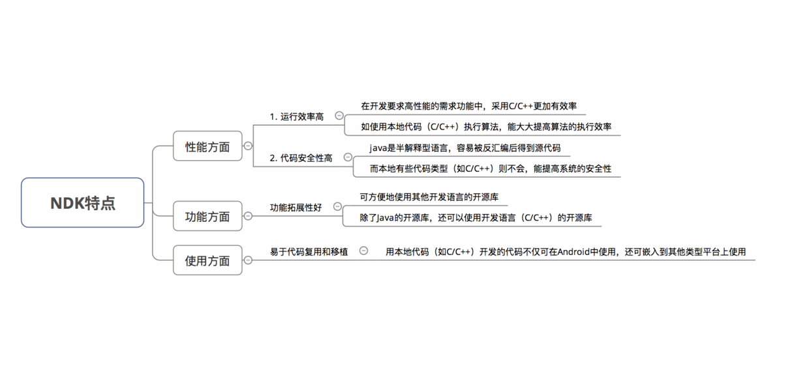

# NDK
NDK特点

## C++
[C++写算法](./C++写算法.md)

[C++基础](./C++.md)
## JNI
JNI开发基础可参考[https://github.com/glumes/AndroidDevWithCpp](https://github.com/glumes/AndroidDevWithCpp)
这个例子使用JNI的对象，异常，NIO,bitmap,线程等基础示例。
## Cmake
Cmkae使用参考[https://juejin.cn/post/6844903678311153672](https://juejin.cn/post/6844903678311153672)
[Android NDK 开发：CMake 使用](http://cfanr.cn/2017/08/26/Android-NDK-dev-CMake-s-usage/)
## Crash定位,tombstone分析
[C/C++ 编译和链接过程详解 (重定向表，导出符号表，未解决符号表)](https://www.cnblogs.com/wfwenchao/articles/4140771.html)
[Tombstone 分析](https://www.cnblogs.com/codertian/p/5980426.html)
[ndk-stack](https://developer.android.com/ndk/guides/ndk-stack)
demo中有使用ndk-stack解析出调用链

